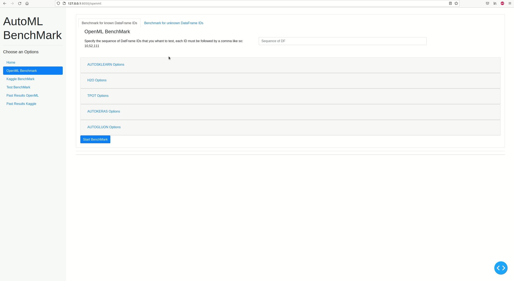
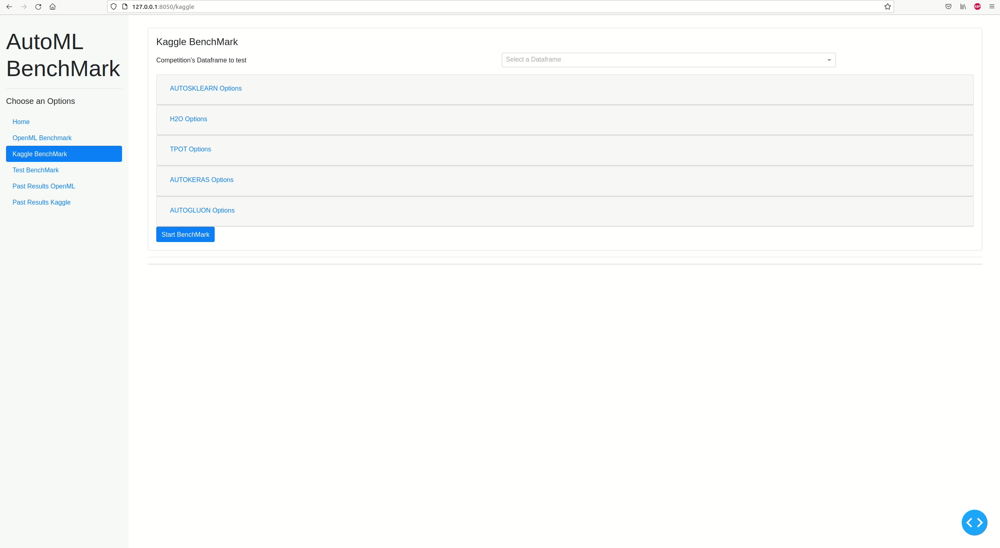
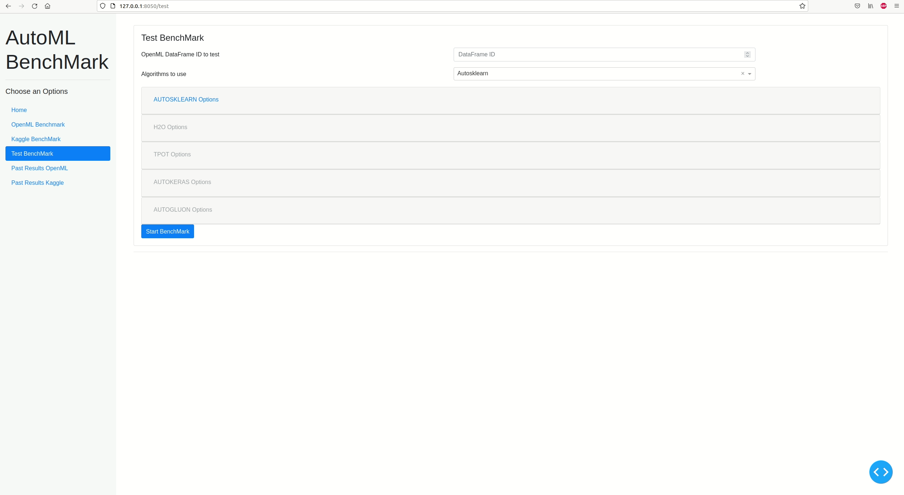

# NO LONGER MANTAINED, TOO MANY DEPENDENIES ERROR
# AutoML-Benchmark
Benchmark for some usual automated machine learning, such as: [AutoSklearn](https://automl.github.io/auto-sklearn/master/), [MLJAR](https://supervised.mljar.com/), [H2O](https://docs.h2o.ai/h2o/latest-stable/h2o-docs/automl.html), [TPOT](http://epistasislab.github.io/tpot/) and [AutoGluon](https://auto.gluon.ai/stable/index.html). All visualized via a responsive [Dash Ploty](https://dash.plotly.com/) Web Application.


## Requirements and Installation
The python version for this project is the 3.9, so make sure to have installed
First of all install the python3.9 pip package and then the virtual environment for safety reason: 
```bash
curl https://bootstrap.pypa.io/get-pip.py -o get-pip.py
python3.9 get-pip.py
sudo apt install default-jre
sudo apt install python3.9-venv
```

Then create a new virtual environment:
```bash
python3.9 -m venv my_venv
```

Access at it and activate it:
```bash
cd my_venv
source bin/activate
```

Clone my repository and install all dependencies with:
```bash
make install
```


## Usage
To run the app execute the following line of code:
```bash
python3 start.py
```
Open your favourite browser and go to: [http://127.0.0.1:8050/](http://127.0.0.1:8050/). Here you will be albe to interact with the application

### Type of tests
There are five types of operations:

1. **OpenML Benchmark:** Here you have two options:
    1. You can insert a sequrnce of dataframe ID where each ID is followed by a comma. This command will run a benchmark on the inserted sequence
    2. Or you can choose the number of dataframes each for classification task and for regression task and the number of instances that a dataframe at least has. This command will start a benchmark using openml dataframes


2. **Kaggle Benchmark:** Here you can choose multiple kaggle's dataframes for running a benchmark on them


3. **Test Benchmark:** Here you can run a benchmark on a specific dataframe by insering the *dataframe id* and using a single *algorithm* ot all of them by selecting a options


4. **Past Results OpenML:** Here you can navigate between past *OpenML* benchmark by selecting a specific date, or you can comapre multiple OpenML Benchmarks that have the same dataframes but with different timelife 


5. **Past Results Kaggle:** Here you can navigate between past *Kaggle* benchmark by selecting a specific date, or you can comapre multiple Kaggle Benchmarks that have the same dataframes but with different timelife


### Actions available 
In all operation these action are available:
* Analize the results of _Classification Tasks_ and _Regression Tasks_ by a **Table** visualization, **Bar Charts** visualization and **Scatter Plot** visualization
* See the **Timelife** of all algorithms
* Inspect the **Pipeline** of al algorithms
